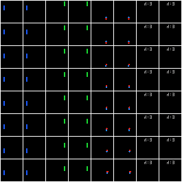
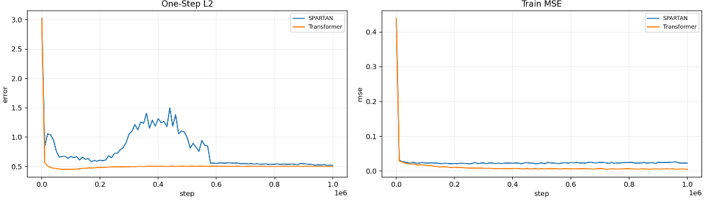

# SPARTAN Interventional Pong Reproduction

This repository implements parts of the following paper:

> **SPARTAN: A Sparse Transformer World Model Attending to What Matters**  
> Lei, Schölkopf, and Posner  
> OpenReview: <https://openreview.net/forum?id=uS5ch7GjZ4>  
> PDF: <https://openreview.net/pdf?id=uS5ch7GjZ4>

Implementation details and results are discussed below.

## Paper and Method


Figure 1: VAE reconstruction example of the Interventional Pong dataset.

SPARTAN is an object-centric Transformer world model. In Interventional Pong, each
frame is decomposed into four object slots: left paddle, right paddle, ball, and
score. A masked-object VAE encodes each object into a 32-dimensional token, and a
Transformer-based world model predicts the next object tokens.

The key idea of the paper is that dense attention in world models can lead to spurious correlations and make it harder to reconstruct the underlying causal graph. SPARTAN instead learns causal masks as hard attention edges: if two objects are not temporally related, the model should not attend to every object at every step. The paper shows that SPARTAN's hard attention leads to better causal graph recovery and more robust dynamics predictions under interventions.

The main difference between SPARTAN and standard Transformer-based models is **hard sparse attention**. SPARTAN samples binary attention
edges from `Bernoulli(sigmoid(q_i^T k_j))`, uses those edges as attention masks,
and penalizes unnecessary paths with a Lagrangian sparsity term. Across multiple
layers, the path matrix is interpreted as a learned causal parent graph: if token
`j` has a path to prediction `i`, then `j` is treated as a parent of `i`.

For interventions, the model appends an environment/intervention token. A path
from this token to an object marks that object as an intervention target. The
baseline is a dense Transformer trained on the same object tokens.

## Reproduction Scope

The aim of this reproduction was to implement the core SPARTAN method, evaluate it on the Interventional Pong dataset, and reproduce the main results of Table 1 and Table 2.

Implemented and evaluated:

- SPARTAN vs dense Transformer on Interventional Pong.
- Table 1: rollout prediction error and graph SHD.
- Table 2: robustness to removing non-causal object tokens.

Not implemented:

- CREATE experiments.
- Traffic / Waymo / MTR experiments.
- ACD, Sparse ACD, Global Graph, or Local Attention baselines.
- Few-shot adaptation on unseen interventions.

## Results

For the experiments, I completed two full runs and several smoke and small-scale runs for tuning. The first run used a batch size of 1024 and trained for 1M steps, which is lower than the paper's 4M steps. The models converged well, but after a point they started to diverge, so the run was stopped at 1M steps and the best checkpoints were used. The second run used a smaller batch size of 512 and trained for the same number of steps, but the models performed worse than in the first run.

In the paper, many implementation and experiment details are ambiguous. Therefore, the reproduction involved tuning and debugging to find settings that led to good performance. The main ambiguities were:
- The paper mentions that the Interventional Pong dataset was modified and that new interventions were added, but it does not specify exactly how the dataset was modified. It only describes what each intervention does, not the specific constants or parameters of the interventions. Therefore, I had to make assumptions and tune the intervention parameters to get good performance.
- The paper does not specify how they aggregate the rollout prediction error across the multi-step rollout.
- The paper does not describe the architecture details of the masked-object VAE, which is a crucial component for the dynamics models' performance. I had to make assumptions and tune the VAE architecture to get good performance.
- The paper does not fully specify several training details that materially affect reproduction, including batch size, input/token normalization, gradient clipping, and learning-rate scheduling.

### Original Paper Results

The paper reports the following Interventional Pong results (Table 1 and Table 2 combined):

| Paper metric | SPARTAN | Transformer |
|---|---:|---:|
| Prediction error | 8.60 | 8.83 |
| SHD | 1.51 | 6.37 |
| Non-causal removal change | 24.5 ± 4.4% | 1140.2 ± 15% |

- SPARTAN is slightly better than Transformer at prediction.
- SPARTAN is much better than Transformer at graph recovery, as measured by SHD.
- SPARTAN is far more robust to non-causal object removal.

### Our Completed Run

These are the best-checkpoint results from the completed run:

| Metric | SPARTAN | Transformer |
|---|---:|---:|
| Rollout L2 | **0.9091** | 1.0429 |
| SHD, paper-style threshold selection | 2.9534 | **2.8862** |
| SHD @ fixed threshold 0.5 (diagnostic) | **2.9534** | 6.5108 |
| Non-causal removal L2 change | **2.9573%** | 78.5275% |

Interpretation and ambiguity notes:

- We reproduce the main Table 2 results: SPARTAN is much less sensitive than
  Transformer to removing non-causal objects, shown by the much smaller L2 and MSE
  percentage changes after removal.
- SPARTAN has better rollout prediction error in our completed run. The paper's
  prediction error uses token-space L2 error, but does not specify the exact
  aggregation over rollout steps. We report mean L2 error per rollout step.
- Transformer has better one-step prediction error.
- In the paper, the Transformer threshold is selected to minimize SHD using
  ground-truth graphs. With that paper-style threshold selection, our completed
  run does **not** reproduce the paper's SPARTAN-over-Transformer SHD result.
- The fixed-threshold `0.5` SHD is included only as a diagnostic. It shows the
  Transformer's dense attention performs poorly at a non-oracle threshold, but it is
  not the paper's reported method.
- We do not numerically reproduce the paper's result scale. This is likely due to
  omitted simulator/VAE details and batch/step differences.


The model training curves are shown here:


Figure 2: Training curves of Transformer and SPARTAN models.

## Code Structure

```text
spartan_pong/
  cli.py          Command-line interface and pipeline orchestration
  data.py         Interventional Pong simulator, renderer, masks, graphs
  vae.py          Masked-object VAE and token export
  models.py       SPARTAN and dense Transformer models
  train.py        Training loop, checkpoints, log-lambda schedule, history
  evaluate.py     Rollout, SHD, robustness, graph diagnostics
  analysis.py     Post-hoc plots and summary reports
  visualize.py    Contact sheets and rollout GIFs
  metrics.py      Metric helpers
  config.py       Constants and dataclasses
  preflight.py    Runtime/storage estimates

tests/            Pytest suite
docs/             Notes, final-run prep, and experiment interpretation
scripts/          Small debugging utilities
```

## Installation

The project uses Python `>=3.11` and `uv`.

For a local CPU/dev environment:

```bash
uv sync
```

On GPUs, avoid `uv sync` if the environment already has a working CUDA
PyTorch install because it may cause a mismatch between the GPU's supported CUDA/Torch version and this repository's dependencies. You can manually install PyTorch with the correct CUDA version, then install this repository's other dependencies without reinstalling PyTorch.
Example GPU-safe setup if needed:

```bash
uv venv --python 3.11
# Use the right CUDA version for your GPU.
uv pip install torch --index-url https://download.pytorch.org/whl/cuxxx
uv pip install -e . --no-deps
uv pip install numpy pillow tqdm matplotlib pytest
```

## Running The Code

### Quick Smoke Test

This quick smoke test runs the whole pipeline with very small datasets, short training, and a tiny VAE. It is mainly intended for debugging.

```bash
uv run spartan-pong run-reproduction \
  --work-dir runs/smoke \
  --train-episodes-per-env 1 \
  --test-episodes-per-env 1 \
  --horizon 3 \
  --vae-steps 2 \
  --dynamics-steps 3 \
  --batch-size 8 \
  --vae-batch-size 8 \
  --device cpu \
  --yes
```

### Full Pipeline

The full pipeline generates data, trains the VAE, exports object tokens, trains
the Transformer, computes SPARTAN's target loss from the Transformer, trains
SPARTAN, evaluates both models, and writes a report.

```bash
uv run spartan-pong run-reproduction \
  --work-dir <run_dir> \
  --train-episodes-per-env 2000 \
  --test-episodes-per-env 300 \
  --horizon 32 \
  --vae-steps 200000 \
  --vae-batch-size 512 \
  --dynamics-steps 4000000 \
  --batch-size 256 \
  --embed-dim 512 \
  --layers 3 \
  --mlp-hidden-dim 512 \
  --mlp-layers 3 \
  --lr 5e-5 \
  --eval-every 2000 \
  --device cuda \
  --yes
```

Resume only if the same run is interrupted:

```bash
uv run spartan-pong run-reproduction \
  --work-dir <run_dir> \
  --device cuda \
  --resume \
  --yes
```

### Analyze a Completed Run

```bash
uv run spartan-pong analyze-run \
  --run-dir <run_dir> \
  --device cpu
```

This writes plots and diagnostics under `<run-dir>/analysis/`, including:

- training curves,
- final metric bars,
- empty-graph baseline,
- threshold sweep diagnostics,
- summary Markdown.
